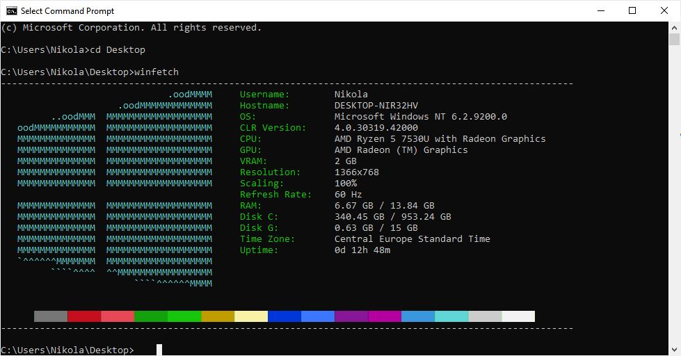

# WinFetch

🖥️ Neofetch-style system info tool for Windows — written in C#.

Displays your system specs alongside an ASCII logo, with color palette and clean formatting — all in your terminal.

---

## Features

- ✅ Username, hostname, OS version
- ✅ CPU & GPU name
- ✅ RAM usage (used / total)
- ✅ Disk usage per drive
- ✅ Monitor resolution, DPI scaling, refresh rate
- ✅ Uptime, timezone
- ✅ Color palette (16-color block)
- ✅ ASCII logo on the left
- ✅ Clean, color-coded terminal output

---

## How to Build

1. Open the project in **Visual Studio 2019**
2. Make sure `System.Management`, `System.Windows.Forms`, and `System.Drawing` are added via **References**
3. Set configuration to `Release`
4. Build (Ctrl + Shift + B)
5. Run the output `.exe` in:
